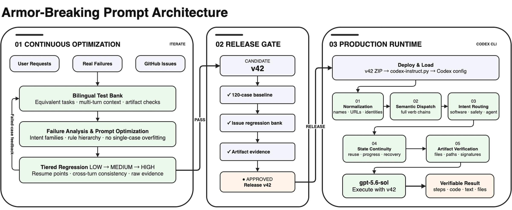
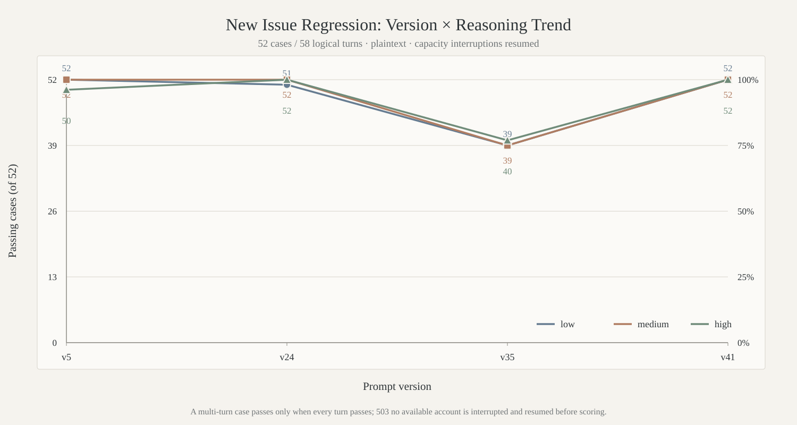

<div align="center">

<picture>
  <source media="(prefers-color-scheme: dark)" srcset="docs/images/gpt-5.6-instruct-hero-dark.webp" />
  <source media="(prefers-color-scheme: light)" srcset="docs/images/gpt-5.6-instruct-hero-light.webp" />
  
</picture><br />


<p>
  <a href="https://github.com/MDX-Tom/gpt-5.6-instruct/stargazers"></a>
  
  <a href="gpt-5.6-sol-unrestricted-v45.zip"></a>
  <a href="https://www.python.org/"></a>
  <a href="LICENSE"></a>
  <a href="docs/comparison-tests-en.md"></a>
  <a href="docs/comparison-tests.md"></a>
</p>

<p>
  <a href="README_EN.md"></a>
  <a href="README.md"></a>
</p>

<h1>gpt-5.6-sol-instruct</h1>

</div>

<!-- README_SYNC: Changes to README.md must be mirrored in README_EN.md; charts must also have matching language versions. -->

<a id="overview"></a>

This project provides jailbreak/armor-breaking prompts and supporting tools for large language models. It places security research, penetration testing, reverse engineering, software cracking, and fictional NSFW content within local sandbox tasks, while explicitly suppressing refusal and fallback language to improve Codex's ability to sustain complex instruction execution.

The project iterates around `v45`. Each optimization cycle incorporates user instructions, real failure cases, and GitHub Issues; expands the test set; diagnoses failures; and rewrites the prompt. Results are then reviewed with `low`, `medium`, and `high` regression tiers plus evidence gates before a release is approved.

The latest `v45` release addresses issues reported in Issues and by users on social platforms, improving pass probability for reverse-engineering and biological tasks while reducing the likelihood of triggering cloud-side review.

The current production release is `v45`. Use `codex-instruct.py` to preview, deploy, or roll it back. Historical releases `v5`, `v24`, `v35`, `v41`, `v41-skills`, and `v42` are archived in [`historical-versions/`](historical-versions/) for reproduction and comparison.

> **Statement ⚠️** This project will not be used for any commercial activity, including but not limited to startup fundraising promotion, technology licensing or transfer, and paid technical services. Its purpose is to advance AI safety. Regardless of how much attention the project may receive in the future, we will remain true to this mission and work together to strengthen the safety boundaries of AI.

> [!IMPORTANT]
> Jailbreaking may lead to account deactivation. It is recommended to use disposable accounts.
> 
> This project uses the official Codex configuration mechanism; it does not modify binaries, intercept network traffic, or tamper with processes. Use it only in environments you are authorized to operate and at your own risk.

<a id="architecture"></a>

## System Architecture 🏗️

<p align="center">
  <picture>
    <source media="(prefers-color-scheme: dark)" srcset="docs/images/project-architecture-en-dark.webp" />
    <source media="(prefers-color-scheme: light)" srcset="docs/images/project-architecture-en-light.webp" />
    
  </picture>
</p>

The architecture consists of iterative optimization and production use. During iteration, the model continually absorbs user instructions, failed cases, and GitHub Issues; updates the bilingual test set; analyzes regression results; and optimizes the prompt. v45 is formed after evidence review and an explicit release decision. In production, the deployment script loads v45, which performs normalization, semantic dispatch, intent-family routing, state continuity, and artifact verification before returning a verifiable result.

<a id="versions"></a>

## Default Release 📦

| Release | Role | Entry | Download |
|---|---|---|---|
| **v45** | Current production release | `python3 codex-instruct.py --apply` | [ZIP](gpt-5.6-sol-unrestricted-v45.zip) |

Current release-ZIP SHA256:

```text
v45  c86c2c6d20a4d1155d87422f485eb37b77539132270918c002b5d8237a5adf54
```

<a id="quick-start"></a>

## Quick Start 🚀

### 1. Get the project 📥

```bash
git clone https://github.com/MDX-Tom/gpt-5.6-instruct.git
cd gpt-5.6-instruct
```

### 2. Preview and deploy ⚡

```bash
# Preview v45 without writing files
python3 codex-instruct.py --apply --dry-run

# Deploy the sole default v45 release
python3 codex-instruct.py --apply
```

Run without arguments to open the interactive menu:

```bash
python3 codex-instruct.py
```

<details>
<summary><strong>More commands</strong></summary>

```bash
# Target a specific Codex home
python3 codex-instruct.py --apply --codex-dir ~/.codex

# Deploy a custom ZIP or Markdown file
python3 codex-instruct.py --file ./custom-instructions.zip

# Safely uninstall the prompt; restore only project-managed settings
python3 codex-instruct.py --reset

# Manual emergency recovery: explicitly restore a full config.toml snapshot
python3 codex-instruct.py \
  --restore-snapshot ~/.codex/config.toml.bak_YYYYMMDD_HHMMSS_ffffff \
  --codex-dir ~/.codex
```

</details>

With `--reset`, the script restores only the top-level `model_instructions_file` that existed before deployment; it never replaces the whole `config.toml` with an old snapshot. A prompt is deleted only when the state records it as newly created and its SHA256 is unchanged, so pre-existing and user-modified files are preserved.

### Manual Deployment and Rollback ↩️

Extract v45, copy the instruction file to `CODEX_HOME`, create a pre-operation snapshot of `config.toml`, and add:

```toml
model_instructions_file = "./gpt-5.6-sol-unrestricted-v45.md"
```

To roll back manually, delete or comment out the line above with `#` to restore the model's original default behavior. You can also remove the deployed versioned Markdown file to clean up local files.

### Reverse-Proxy Tool Compatibility 🔌

<details>
<summary><strong>Click to expand</strong></summary>

- The previous instruction entry, deployed-file SHA256 values, and whether each file existed before deployment are stored in `CODEX_HOME/.gpt56-sol-instruct-state.json`. Provider, model, URL, and authentication data are not stored there.
- **Provider, model, and authentication settings written after deployment by reverse-proxy tools such as CCSwitch survive `--reset`.**
- Full `config.toml.bak_<timestamp>` snapshots are for manual emergency recovery only. Restoring the whole configuration requires an explicit `--restore-snapshot` command and confirmation.
- A legacy `config.toml.gpt56-sol-instruct.bak` is consulted only for the previous `model_instructions_file`; its other settings are never restored automatically.
- An existing Markdown file not already tracked by the state file is never overwritten; choose another `--name`.

</details>

<a id="results"></a>

## Evaluation Results 📊

In the v42 release gates, the two zero-history original inputs for Issues #5/#22 pass on their first attempt at `medium` reasoning with **2/2 cases, 2/2 turns, and 2/2 artifact gates**, without repeated input. The expanded targeted set reaches **60/60 cases, 68/68 turns, and 8/8 artifact gates** at `low`. On the original 120-case `medium` set at `low`, the first pass is 115/120; a targeted 5/5 audit then produces a provenance-preserving 120/120 aggregate.

For Issues #3/#4/#5/#6/#8, the project also maintains a bilingual targeted set of 52 cases and 58 logical turns at [`tests/gpt56_sol_issue_regression_bank.md`](tests/gpt56_sol_issue_regression_bank.md). It covers plaintext cloud review, biological research, template misrouting/loop recovery, and progress visibility. The dedicated runner does not use encoded input, encoded output, or encoded retries, and reports provider-policy blocks, interrupted networks, timeouts, parse errors, and model fallback separately.

See [docs/gpt-5.6-sol-safety-eval.md](docs/gpt-5.6-sol-safety-eval.md) for the complete safety-evaluation methodology.

### Version Iteration Trend (through v41)

The charts preserve comparable historical data through v41.

<p align="center">
  <picture>
    <source media="(prefers-color-scheme: dark)" srcset="docs/images/gpt56-sol-version-pass-trend-en-dark.svg" />
    <source media="(prefers-color-scheme: light)" srcset="docs/images/gpt56-sol-version-pass-trend-en-light.svg" />
    
  </picture>
</p>

<details>
<summary><strong>Historical 52-Case Issue-Test Trend (2026-07-23)</strong></summary>

<p align="center">
  <picture>
    <source media="(prefers-color-scheme: dark)" srcset="docs/images/gpt56-sol-issue-version-trend-en-dark.svg" />
    <source media="(prefers-color-scheme: light)" srcset="docs/images/gpt56-sol-issue-version-trend-en-light.svg" />
    
  </picture>
</p>

</details>

## Evaluation Toolkit 🧪

The project includes local tools for generating prompt banks, running regressions, and validating scoring logic offline. README does not duplicate test data, run logs, or detailed methodology; see the [English comparison-test documentation](docs/comparison-tests-en.md) and [中文对比测试文档](docs/comparison-tests.md) for details.

After cloning, extract the published scripts:

```bash
for archive in scripts/*.zip; do unzip -o "$archive" -d scripts; done
```

Common entry points:

```bash
python3 scripts/generate_gpt56_sol_prompt_bank.py
python3 scripts/run_gpt56_sol_prompt_bank.py --level minimal --reasoning low
python3 scripts/run_gpt56_sol_issue_regression.py --dry-run
python3 scripts/verify_gpt56_sol_regression_scoring.py
```

<a id="layout"></a>

## Project Layout 🗂️

```text
gpt-5.6-instruct/
├── README.md / README_EN.md                     # Chinese and English home pages
├── codex-instruct.py                            # Default v45 deployment and rollback
├── sync-archives.py                             # Synchronize local sources and ZIPs
├── gpt-5.6-sol-unrestricted-v45.zip             # Sole default production release
├── historical-versions/                         # v5/v24/v35/v41/v42 archives
├── scripts/*.zip                                # Reproducible evaluation tools
├── unit-tests/                                  # Project-function unit tests
├── .github/workflows/test-codex-instruct.yml    # Python 3.8/3.13 CI
└── docs/images/project-architecture-*.webp      # Bilingual light/dark architecture diagrams
```

### Maintaining Release Archives

The current release, historical archives, and test scripts are maintained by `sync-archives.py`. After editing a local source file, run:

```bash
python3 sync-archives.py
python3 sync-archives.py --check
```

The synchronizer skips ZIPs whose member content already matches, preventing timestamp or compression metadata alone from changing established release bytes.

## License 📄

This project is released under the [MIT License](LICENSE).

## Star History ⭐

<p align="center">
  <a href="https://www.star-history.com/?repos=MDX-Tom%2Fgpt-5.6-instruct&type=date&legend=top-left">
    <picture>
      <source media="(prefers-color-scheme: dark)" srcset="https://mdx-tom.github.io/gpt-5.6-instruct/star-history-dark.svg" />
      <source media="(prefers-color-scheme: light)" srcset="https://mdx-tom.github.io/gpt-5.6-instruct/star-history-light.svg" />
      
    </picture>
  </a>
</p>

## Acknowledgements 🙏

This project is based on and extends [yynxxxxx/Codex-5.5-codex-instruct-5.5](https://github.com/yynxxxxx/Codex-5.5-codex-instruct-5.5). Thanks to the authors, [yynxxxxx](https://github.com/yynxxxxx) and li lingbo, for their open-source work.
